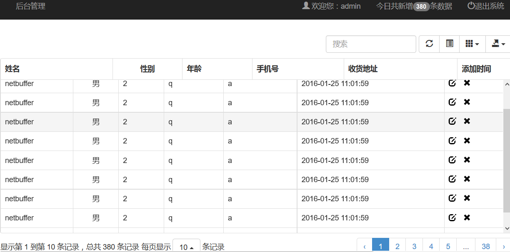

# jfinal-bootstrap-table demo
## 技术栈/technology stack
* jfinal2.2
* poi3
* ehcache
* 自定义标签开发
* bootstrap3
* bootstrap-table1.9
* druid
* weui

## How to run
> The project constructed by maven, please execute under the src/main/java SQL script to your MySQL database operation, 
and then modify the database configuration information ,edit under the src/main/java config.txt configuration file,
Execute mvn tomcat7:run to run

## 运行
> 项目采用maven构建，运行前请先执行src/main/java下的sql脚本到你的mysql数据库中，然后修改src/main/java下的config.txt配置文件中的数据库配置信息，进入项目目录，
执行mvn tomcat7:run来运行

> ## github:[https://github.com/netbuffer/jfinal-bootstrap-table](https://github.com/netbuffer/jfinal-bootstrap-table)
> ## git@osc:[http://git.oschina.net/gradle/jfinal-bootstrap-table](http://git.oschina.net/gradle/jfinal-bootstrap-table)

# 
# 